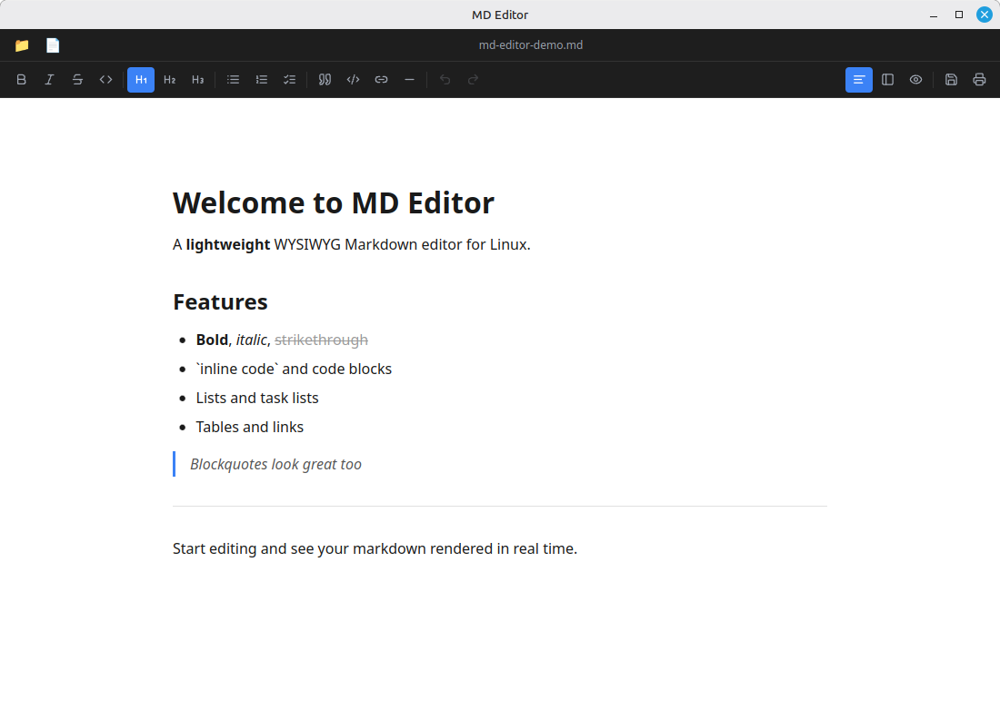

# MD Editor

[](https://github.com/fchevitarese/md-editor/releases)
[](LICENSE)

A lightweight WYSIWYG Markdown editor, built with [Tauri](https://tauri.app/) + [TipTap](https://tiptap.dev/).

Opens `.md` files rendered — no raw syntax visible unless you want it. Edit visually, save as clean Markdown.



## Install

### Ubuntu / Debian / Linux Mint

Download the `.deb` from [Releases](https://github.com/fchevitarese/md-editor/releases):

```bash
sudo dpkg -i MD Editor_*.deb
```

### Fedora / RHEL

Download the `.rpm` from [Releases](https://github.com/fchevitarese/md-editor/releases):

```bash
sudo rpm -i MD Editor-*.rpm
```

### Windows

Download the `.exe` (NSIS installer) or `.msi` from [Releases](https://github.com/fchevitarese/md-editor/releases).

### Flatpak (coming soon)

```bash
flatpak install flathub com.fred.md-editor
```

## Features

- **WYSIWYG editing** — bold, italic, headings, lists, tables, code blocks, task lists, links
- **Split view** — source (raw Markdown) on the left, rendered preview on the right
- **Preview mode** — read-only rendered view
- **File tree sidebar** — open a folder and browse files like VS Code
- **Session restore** — reopens the last file and folder on startup
- **Export to PDF** — print dialog with clean stylesheet (toolbar/sidebar hidden)
- **File associations** — register as default app for `.md` / `.markdown` files
- **Keyboard shortcuts** — `Ctrl+S` save, `Ctrl+O` open file, `Ctrl+Shift+O` open folder

## Requirements

- [Rust](https://rustup.rs/) (stable toolchain)
- [Node.js](https://nodejs.org/) 18+
- Tauri v2 system dependencies:

```bash
# Ubuntu / Debian
sudo apt install libwebkit2gtk-4.1-dev libgtk-3-dev libayatana-appindicator3-dev librsvg2-dev
```

## Development

```bash
git clone https://github.com/fchevitarese/md-editor.git
cd md-editor
npm install --legacy-peer-deps
npm run tauri dev
```

> **Note:** If your system has a custom `cc` wrapper that conflicts with Cargo's C compiler,
> the included `.cargo/config.toml` forces `/usr/bin/gcc` as the linker automatically.

## Build (release binary)

```bash
npm run tauri build
```

The binary and `.deb` / `.rpm` packages will be in `src-tauri/target/release/bundle/`.

## Tech stack

| Layer | Technology |
|---|---|
| Shell | [Tauri v2](https://tauri.app/) (Rust) |
| Frontend | React 18 + TypeScript + Vite |
| Editor | [TipTap v2](https://tiptap.dev/) (ProseMirror) |
| Markdown serialization | [tiptap-markdown](https://github.com/aguingand/tiptap-markdown) |
| Markdown rendering | [marked](https://marked.js.org/) (split/preview modes) |
| Icons | [Lucide React](https://lucide.dev/) |

## License

MIT
